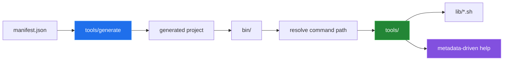
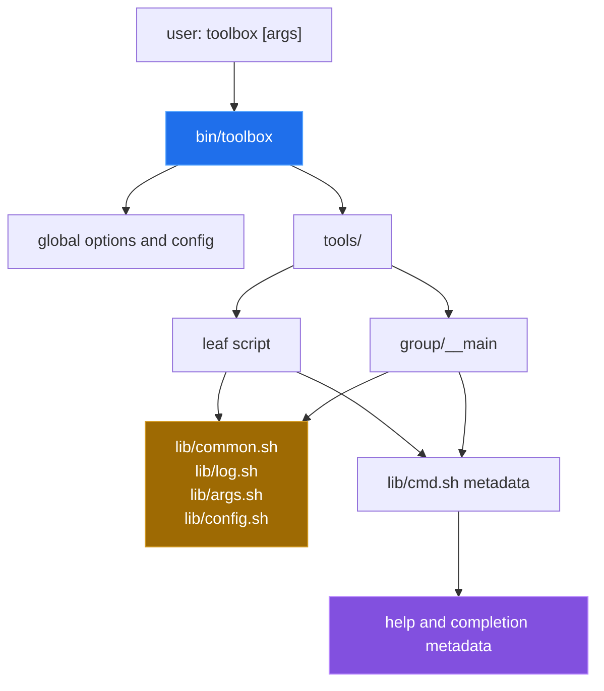

# Toolbox.sh — POSIX CLI Toolkit and Generator

Toolbox.sh is a shell framework for Git-style command suites: a dispatcher
maps command paths to executable files, shared libraries provide logging,
argument parsing and configuration, and a JSON manifest can describe a new
project. The repository contains the source scaffold, command templates and a
TAP-style test harness.



## Quick start

The version probe is copy-pasteable from the current checkout:

```sh
/bin/sh bin/toolbox --version
/bin/sh bin/toolbox help
```

Both commands exit successfully: the first prints `toolbox 0.1.0`, the second
lists five discovered commands. `./bin/toolbox` also runs directly. The Linux
run behind these results is reproducible with:

```sh
sh devtools/linux-run.sh
```

The generator sequence is:

```sh
cat >manifest.json <<'JSON'
["status", {"name": "report", "commands": ["daily"]}]
JSON
/bin/sh bin/toolbox generate --name depot --manifest manifest.json --dest ./depot
cd depot
/bin/sh bin/depot help
```

The sequence completes, and `/bin/sh bin/depot help` lists the generated
`report` and `status` commands with the project's own name and version in the
help text. The generated project's own `tests/run` fails; see
[Known limitations](#known-limitations).

## Architecture

The top-level tree and a generated tree use the same dispatcher and library
shape. Directories below `tools/` are command groups; an executable `__main`
file represents the group itself.



## Capabilities

| Area | Source | Role | Checked in Linux |
|---|---|---|---|
| Dispatch | `bin/toolbox`,<br/>`lib/common.sh` | Resolves leaf and grouped command paths. | `help` lists five commands;<br/>`hello Alice` gets its argument. |
| Command metadata | `lib/cmd.sh`,<br/>command scripts | Renders usage, options, subcommands and examples. | `depot report daily --help` renders<br/>with the project name. |
| New commands | `tools/new`,<br/>`templates/command/` | Copies and fills a leaf or group stub. | `new --group demo` creates `demo/__main`. |
| Project generation | `tools/generate`,<br/>`templates/project/` | Copies a skeleton,<br/>renames its dispatcher and creates manifest paths. | Exits `0`; nested `report daily` runs.<br/>Its copied tests fail (open bug 11). |
| Completion | `tools/completion` | Emits shell completion from command metadata. | `__all_commands` works under `dash`;<br/>not installed into a shell. |
| Tests | `tests/run`,<br/>`tests/*.t` | Runs the TAP-style checks. | 20/20 under `dash` and `bash`. |

## Results

These values come from `devtools/linux-run.sh` in `python:3.12-slim-bookworm`,
where `/bin/sh` is `dash`, at commit `a8861f0`:

| Check | Result |
|---|---:|
| tracked files | 55 |
| tracked executable files | 21 |
| `./bin/toolbox --version` exit status | 0 |
| discovered commands in `help` | 5 |
| `tests/run` under `dash` / `bash` | 20 / 20 passed, exit 0 |
| generator exit status | 0 |
| generated project `tests/run` | 0 / 14 passed, exit 1 |

Details are in [`docs/measurement.md`](docs/measurement.md).

## Repository layout

| Path | Responsibility |
|---|---|
| `bin/toolbox` | Top-level dispatcher and global option handling. |
| `lib/` | Shared shell libraries for resolution, logging, arguments, config and metadata. |
| `tools/` | Built-in commands such as `generate`, `new`, `hello` and `completion`. |
| `templates/command/` | Leaf, group and ignore-file templates. |
| `templates/project/` | Files copied into a generated project. |
| `tests/` | TAP-like shell tests and their harness. |
| `docs/` | Component write-ups, measurements and the bug ledger. |
| `devtools/` | `measure.py` probe and the `linux-run.sh` container run. |

## Known limitations

- The dispatcher and the generated projects target POSIX `sh`. Bash-specific
  syntax in a command file will not be caught by the framework.
- `tests/run` is a TAP-style harness with no external dependencies; it exercises
  the dispatcher and the generator, not a matrix of shells or platforms.
- The generator writes a skeleton from a fixed template set. A project that
  needs a different layout has to diverge from the template after generation.
- Open bug 11: a generated project's `tests/run` fails all 14 assertions,
  because the copied tests still call `bin/toolbox` and expect the `hello` and
  `generate` commands.
- The checks run on Linux only. The two macOS-specific fixes (entries 4 and 7
  in [`docs/BUGS-FOUND.md`](docs/BUGS-FOUND.md)) were not re-run on macOS.

Ten earlier bugs are fixed, among them the missing executable bits, the
generated project's missing `lib/config.sh`, dropped positional arguments and
the non-POSIX substitution under `dash`. See
[`docs/BUGS-FOUND.md`](docs/BUGS-FOUND.md).

## Further documentation

- [`docs/architecture.md`](docs/architecture.md) — dispatcher and scaffold structure.
- [`docs/GENERATOR_GUIDE.md`](docs/GENERATOR_GUIDE.md) — manifest and generation lifecycle.
- [`docs/commands.md`](docs/commands.md) — command metadata and conventions.
- [`docs/measurement.md`](docs/measurement.md) — the Linux run behind every result.
- [`docs/BUGS-FOUND.md`](docs/BUGS-FOUND.md) — ten fixed bugs and one open one.
