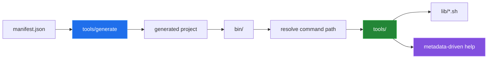
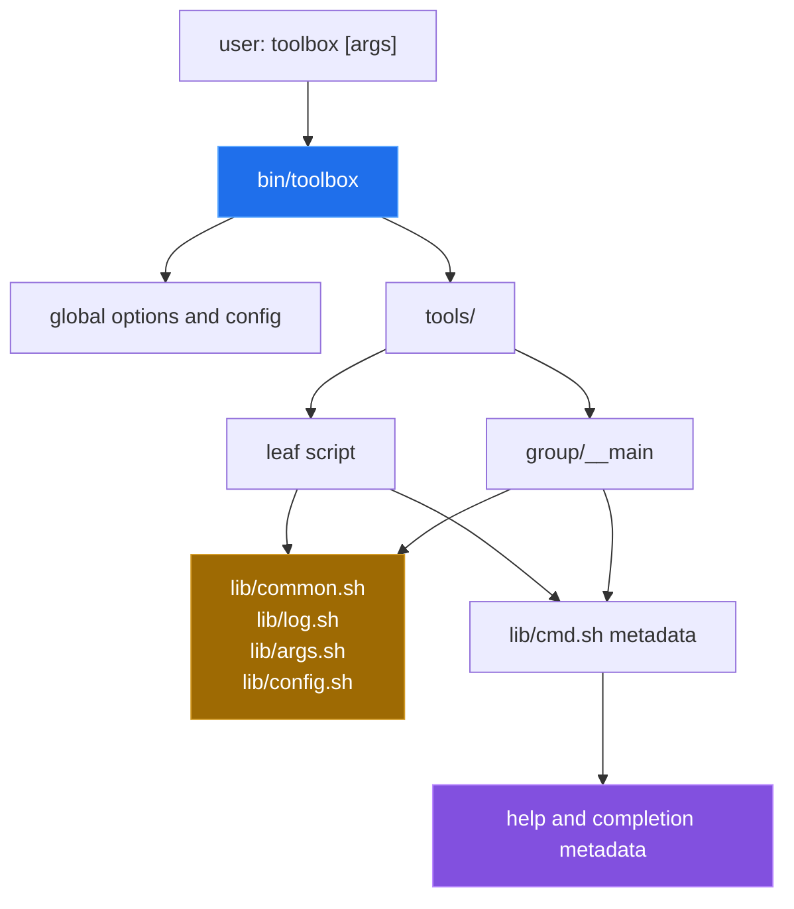

# Toolbox.sh — POSIX CLI Toolkit and Generator

Toolbox.sh is a shell framework for Git-style command suites: a dispatcher
maps command paths to executable files, shared libraries provide logging,
argument parsing and configuration, and a JSON manifest can describe a new
project. The repository contains the source scaffold, command templates and a
TAP-style test harness. This documentation describes the checkout as it is
currently committed, including the defects recorded in
[`docs/BUGS-FOUND.md`](docs/BUGS-FOUND.md).



## Quick start

The version probe is copy-pasteable from the current checkout:

```sh
/bin/sh bin/toolbox --version
/bin/sh bin/toolbox help
```

The first command exits successfully and prints `toolbox 0.1.0`. The second
command also exits successfully, but currently shows an empty `Commands:`
section. Invoking `./bin/toolbox` directly returns permission denied because
the tracked scripts have no executable bit. The exact probe is reproducible
with:

```sh
python3 devtools/measure.py
```

The intended generator sequence is:

```sh
cat >manifest.json <<'JSON'
["status", {"name": "report", "commands": ["daily"]}]
JSON
/bin/sh bin/toolbox generate --name depot --manifest manifest.json --dest ./depot
cd depot
/bin/sh bin/depot help
```

On this revision the sequence cannot complete: after runtime permissions are
prepared in a scratch copy, generation stops when `tools/new` sources the
missing generated `lib/config.sh`. That failure is measured and explained in
[`docs/measurement.md`](docs/measurement.md), not hidden behind a fabricated
successful transcript.

## Architecture

The top-level tree and a generated tree use the same dispatcher and library
shape. Directories below `tools/` are command groups; an executable `__main`
file represents the group itself.



## Capabilities

| Area | Source | Actual role | Current verification |
|---|---|---|---|
| Dispatch | `bin/toolbox`,<br/>`lib/common.sh` | Resolves leaf and grouped command paths. | Version succeeds;<br/>command discovery is empty. |
| Command metadata | `lib/cmd.sh`,<br/>command scripts | Renders usage, options, subcommands and examples. | Source-defined;<br/>test execution is blocked. |
| New commands | `tools/new`,<br/>`templates/command/` | Copies and fills a leaf or group stub. | Group creation fails on macOS shell syntax. |
| Project generation | `tools/generate`,<br/>`templates/project/` | Copies a skeleton,<br/>renames its dispatcher and creates manifest paths. | Scratch run stops at generated `lib/config.sh`. |
| Completion | `tools/completion` | Emits shell completion from command metadata. | Positional handling and discovery block a useful run. |
| Tests | `tests/run`,<br/>`tests/*.t` | Runs the TAP-style checks. | Current checkout exits `127`. |

## Measured results

The following values come from `python3 devtools/measure.py` on the checkout
at `e4cd682`:

| Probe | Result |
|---|---:|
| tracked files | 48 |
| tracked executable files | 0 |
| `/bin/sh bin/toolbox --version` exit status | 0 |
| discovered commands in `help` | 0 |
| `./bin/toolbox --version` exit status | 126 |
| `/bin/sh tests/run` exit status | 127 |
| scratch generator exit status | 1 |

The scratch probe changes permissions only inside a temporary archive so it can
reach the generator code. It does not change this checkout. Its command still
stops at `templates/project/lib/config.sh`, which does not exist in the
current tree.

## Repository layout

| Path | Responsibility |
|---|---|
| `bin/toolbox` | Top-level dispatcher and global option handling. |
| `lib/` | Shared shell libraries for resolution, logging, arguments, config and metadata. |
| `tools/` | Built-in commands such as `generate`, `new`, `hello` and `completion`. |
| `templates/command/` | Leaf, group and ignore-file templates. |
| `templates/project/` | Files copied into a generated project. |
| `tests/` | TAP-like shell tests and their harness. |
| `docs/` | Component write-ups, measurements and the bug ledger. |
| `devtools/measure.py` | Reproducible documentation-pass measurements. |

## Known limitations

- The tracked shell files are mode `100644`, so direct execution fails and the
  dispatcher cannot discover executable commands.
- `bin/toolbox` and `tools/new` use GNU `find -printf`; on the macOS shell the
  directory listing becomes empty even after permissions are prepared.
- The dispatcher consumes positional arguments while probing command paths. For
  example, `hello Alice` does not pass `Alice` to the leaf command.
- The generated project omits `lib/config.sh`, so its first generated command
  cannot source its libraries. The template ignore rule also ignores a nested
  `config.sh` path.
- Nested generated commands calculate the project root from their immediate
  directory and then source a nonexistent nested `lib/` directory.
- `tools/new` contains a `case` branch inside a command substitution that the
  macOS shell rejects before it can scaffold a group.
- `_list_all_command_paths` uses non-POSIX `${value//old/new}` expansion. Under
  `dash`, `__all_commands` reports `Bad substitution` and completion has no
  usable command list.
- The generated dispatcher keeps its help heredoc quoted, so its displayed
  `${TOOLBOX_NAME}` and `${TOOLBOX_VERSION}` remain literal.

Each item has a reproduction and a proposed, uncommitted fix in
[`docs/BUGS-FOUND.md`](docs/BUGS-FOUND.md). The documentation-only scope means
the source remains unchanged.

## Further documentation

- [`docs/architecture.md`](docs/architecture.md) — dispatcher and scaffold structure.
- [`docs/GENERATOR_GUIDE.md`](docs/GENERATOR_GUIDE.md) — manifest and generation lifecycle.
- [`docs/commands.md`](docs/commands.md) — command metadata and conventions.
- [`docs/measurement.md`](docs/measurement.md) — provenance for every published result.
- [`docs/BUGS-FOUND.md`](docs/BUGS-FOUND.md) — verified defects and proposed diffs.
