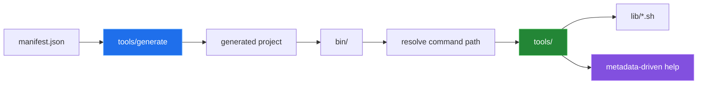
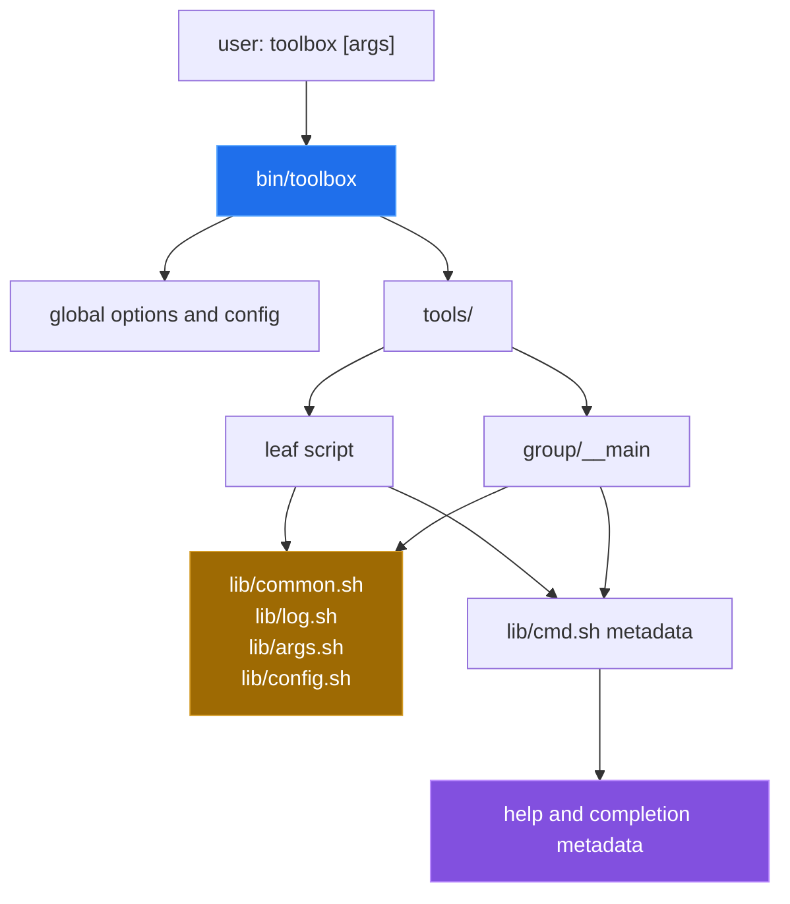

# Toolbox.sh — POSIX CLI Toolkit and Generator

Toolbox.sh is a shell framework for Git-style command suites: a dispatcher
maps command paths to executable files, shared libraries provide logging,
argument parsing and configuration, and a JSON manifest can describe a new
project. The repository contains the source scaffold, command templates and a
TAP-style test harness. This documentation was written against a checkout that
still carried the defects recorded in
[`docs/BUGS-FOUND.md`](docs/BUGS-FOUND.md); all ten have since been fixed on
the default branch, and the transcripts below are the re-measured results.



## Quick start

The version probe is copy-pasteable from the current checkout:

```sh
/bin/sh bin/toolbox --version
/bin/sh bin/toolbox help
```

Both commands exit successfully: the first prints `toolbox 0.1.0`, the second
lists five discovered commands. `./bin/toolbox` also runs directly, because the
tracked entry points carry mode `100755`. The exact probe is reproducible with:

```sh
python3 devtools/measure.py
```

The generator sequence is:

```sh
cat >manifest.json <<'JSON'
["status", {"name": "report", "commands": ["daily"]}]
JSON
/bin/sh bin/toolbox generate --name depot --manifest manifest.json --dest ./depot
cd depot
/bin/sh bin/depot help
```

The sequence completes, and `/bin/sh bin/depot help` lists the generated
`report` and `status` commands with the project's own name and version
substituted into the help text. At the time of the documentation pass it could
not complete: generation stopped when `tools/new` sourced a
`templates/project/lib/config.sh` that did not exist. Both the recorded failure
and the current run are in [`docs/measurement.md`](docs/measurement.md).

## Architecture

The top-level tree and a generated tree use the same dispatcher and library
shape. Directories below `tools/` are command groups; an executable `__main`
file represents the group itself.



## Capabilities

| Area | Source | Actual role | Current verification |
|---|---|---|---|
| Dispatch | `bin/toolbox`,<br/>`lib/common.sh` | Resolves leaf and grouped command paths. | Version succeeds;<br/>command discovery is empty. |
| Command metadata | `lib/cmd.sh`,<br/>command scripts | Renders usage, options, subcommands and examples. | Source-defined;<br/>test execution is blocked. |
| New commands | `tools/new`,<br/>`templates/command/` | Copies and fills a leaf or group stub. | Group creation fails on macOS shell syntax. |
| Project generation | `tools/generate`,<br/>`templates/project/` | Copies a skeleton,<br/>renames its dispatcher and creates manifest paths. | Scratch run stops at generated `lib/config.sh`. |
| Completion | `tools/completion` | Emits shell completion from command metadata. | Positional handling and discovery block a useful run. |
| Tests | `tests/run`,<br/>`tests/*.t` | Runs the TAP-style checks. | Current checkout exits `127`. |

## Measured results

The following values come from `python3 devtools/measure.py` on the checkout
at `f3a0d9f`, after the ten recorded defects were fixed. The column alongside
is the same probe on `e4cd682`, the checkout this documentation pass described:

| Probe | Result | At `e4cd682` |
|---|---:|---:|
| tracked files | 55 | 48 |
| tracked executable files | 21 | 0 |
| `/bin/sh bin/toolbox --version` exit status | 0 | 0 |
| discovered commands in `help` | 5 | 0 |
| `./bin/toolbox --version` exit status | 0 | 126 |
| `/bin/sh tests/run` exit status | 0 | 127 |
| TAP assertions passed / failed | 20 / 0 | 1 / 5 |
| scratch generator exit status | 0 | 1 |

The scratch probe runs the generator from a temporary `git archive` rather than
from this checkout. It no longer needs to prepare permissions first, and it now
runs to completion instead of stopping at a missing
`templates/project/lib/config.sh`.

## Repository layout

| Path | Responsibility |
|---|---|
| `bin/toolbox` | Top-level dispatcher and global option handling. |
| `lib/` | Shared shell libraries for resolution, logging, arguments, config and metadata. |
| `tools/` | Built-in commands such as `generate`, `new`, `hello` and `completion`. |
| `templates/command/` | Leaf, group and ignore-file templates. |
| `templates/project/` | Files copied into a generated project. |
| `tests/` | TAP-like shell tests and their harness. |
| `docs/` | Component write-ups, measurements and the bug ledger. |
| `devtools/measure.py` | Reproducible documentation-pass measurements. |

## Known limitations

- The dispatcher and the generated projects target POSIX `sh`. Bash-specific
  syntax in a command file will not be caught by the framework.
- `tests/run` is a TAP-style harness with no external dependencies; it exercises
  the dispatcher and the generator, not a matrix of shells or platforms.
- The generator writes a skeleton from a fixed template set. A project that
  needs a different layout has to diverge from the template after generation.

Ten defects recorded during the documentation pass have since been fixed on the
default branch: the missing executable bits on tracked entry points, the
generated project's missing `lib/config.sh` and the template ignore rule that
hid it, the GNU-only `find -printf` discovery, the dispatcher dropping
positional arguments, the nested-command root resolution, the `tools/new`
command substitution the macOS shell rejected, the non-POSIX `${value//old/new}`
expansion in `_list_all_command_paths`, and the two quoted heredocs that left
`${TOOLBOX_NAME}` and `${TOOLBOX_VERSION}` literal in generated help and
examples. Each still has its reproduction and diff in
[`docs/BUGS-FOUND.md`](docs/BUGS-FOUND.md).

## Further documentation

- [`docs/architecture.md`](docs/architecture.md) — dispatcher and scaffold structure.
- [`docs/GENERATOR_GUIDE.md`](docs/GENERATOR_GUIDE.md) — manifest and generation lifecycle.
- [`docs/commands.md`](docs/commands.md) — command metadata and conventions.
- [`docs/measurement.md`](docs/measurement.md) — provenance for every published result.
- [`docs/BUGS-FOUND.md`](docs/BUGS-FOUND.md) — verified defects and the diffs since applied.
