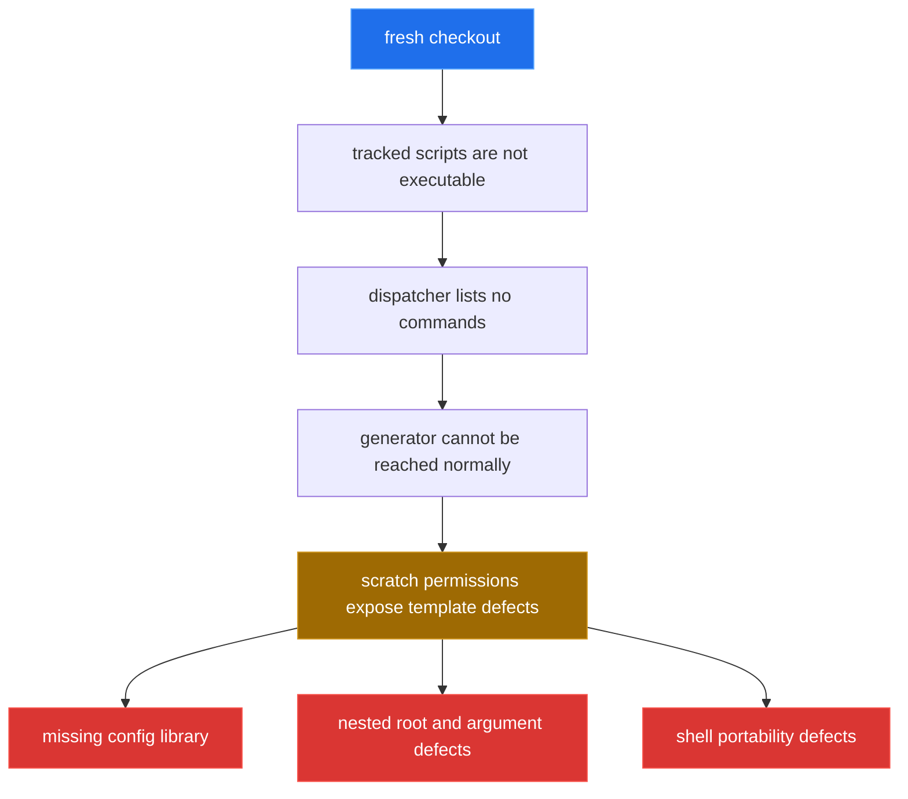

[← back to the overview](../README.md)

# Bugs found during the documentation pass

This file records defects in the reverted checkout at `e4cd682`. No source fix
described here was applied during the documentation pass itself. The first
saved patch contains fixes proposed during the interrupted pass; the second
contains the dropped `b5f6e4d` source commit. Reproductions below were run
against that checkout or a temporary copy when runtime permissions were needed.

> **Since this pass:** an independent adjudication confirmed all ten entries,
> and a subsequent fix pass applied all ten to the default branch, in commits
> `1709acf`, `5d89519`, `3e96df1`, `6b1fe41`, `c0ba03d`, `ed519f9`, `c58633c`,
> `fc4dabd`, `6715cf4` and `272de6b`, in the order the entries appear below.
> Re-running `python3 devtools/measure.py` on the fixed tree reports 21
> executable tracked files, five discovered commands, a `tests/run` exit status
> of `0` with 20 of 20 TAP assertions passing, and a generator probe that runs
> to completion. Read the reproductions and diffs below as the state at the
> time of the pass, not as the current state of the default branch.



## Tracked scripts have no executable bit

**Location:** file-mode metadata for these tracked files:

```text
bin/toolbox
packaging/deb/build.sh
packaging/deb/toolbox-wrapper.sh
templates/project/bin/toolbox
templates/project/tests/cli.t
templates/project/tests/generate.t
templates/project/tests/hello.t
templates/project/tests/run
templates/project/tools/completion
templates/project/tools/hello
templates/project/tools/new
templates/project/tools/self-update
tests/cli.t
tests/generate.t
tests/hello.t
tests/run
tools/completion
tools/generate
tools/hello
tools/new
tools/self-update
```

**What happens:** `git ls-files -s` reports mode `100644` for every file in
that list. Direct execution of `./bin/toolbox --version` returns permission
denied with status `126`. Invoked as `/bin/sh bin/toolbox`, the dispatcher runs
but its executable-file discovery finds no commands.

**Reproduce:**

```sh
git ls-files -s bin/toolbox tools/new tests/run
./bin/toolbox --version
```

The proposed fix from the dropped commit is only a mode change:

```diff
diff --git a/bin/toolbox b/bin/toolbox
old mode 100644
new mode 100755
diff --git a/packaging/deb/build.sh b/packaging/deb/build.sh
old mode 100644
new mode 100755
diff --git a/packaging/deb/toolbox-wrapper.sh b/packaging/deb/toolbox-wrapper.sh
old mode 100644
new mode 100755
diff --git a/templates/project/bin/toolbox b/templates/project/bin/toolbox
old mode 100644
new mode 100755
diff --git a/templates/project/tests/cli.t b/templates/project/tests/cli.t
old mode 100644
new mode 100755
diff --git a/templates/project/tests/generate.t b/templates/project/tests/generate.t
old mode 100644
new mode 100755
diff --git a/templates/project/tests/hello.t b/templates/project/tests/hello.t
old mode 100644
new mode 100755
diff --git a/templates/project/tests/run b/templates/project/tests/run
old mode 100644
new mode 100755
diff --git a/templates/project/tools/completion b/templates/project/tools/completion
old mode 100644
new mode 100755
diff --git a/templates/project/tools/hello b/templates/project/tools/hello
old mode 100644
new mode 100755
diff --git a/templates/project/tools/new b/templates/project/tools/new
old mode 100644
new mode 100755
diff --git a/templates/project/tools/self-update b/templates/project/tools/self-update
old mode 100644
new mode 100755
diff --git a/tests/cli.t b/tests/cli.t
old mode 100644
new mode 100755
diff --git a/tests/generate.t b/tests/generate.t
old mode 100644
new mode 100755
diff --git a/tests/hello.t b/tests/hello.t
old mode 100644
new mode 100755
diff --git a/tests/run b/tests/run
old mode 100644
new mode 100755
diff --git a/tools/completion b/tools/completion
old mode 100644
new mode 100755
diff --git a/tools/generate b/tools/generate
old mode 100644
new mode 100755
diff --git a/tools/hello b/tools/hello
old mode 100644
new mode 100755
diff --git a/tools/new b/tools/new
old mode 100644
new mode 100755
diff --git a/tools/self-update b/tools/self-update
old mode 100644
new mode 100755
```

## The generated project has no `lib/config.sh`

**Location:** `templates/project/lib/config.sh` is absent; generated
`tools/new` tries to source it at `templates/project/tools/new:17`.

**What happens:** generation copies the skeleton, then fails when the first
generated command invokes `tools/new`:

```text
toolbox: Copying skeleton into <scratch>/depot
<scratch>/depot/tools/new: line 17: <scratch>/depot/lib/config.sh: No such file or directory
```

**Reproduce:** run `python3 devtools/measure.py`. Its scratch probe archives
the current `HEAD`, prepares permissions only in that archive, and runs the
real generator. The failure above is its recorded output. This is verified.

The proposed fix is the file addition from the dropped commit. It copies the
same XDG/config implementation used by the top-level `lib/config.sh`:

```diff
diff --git a/templates/project/lib/config.sh b/templates/project/lib/config.sh
new file mode 100644
--- /dev/null
+++ b/templates/project/lib/config.sh
@@
+#!/bin/sh
+set -eu
+
+# Determine XDG paths with fallbacks
+_xdg_home() {
+  var=$1; def=$2
+  eval v="\${$var-}"
+  [ -n "${v:-}" ] && { printf '%s\n' "$v"; return; }
+  printf '%s\n' "$def"
+}
+
+XDG_CONFIG_HOME=$(_xdg_home XDG_CONFIG_HOME "$HOME/.config")
+XDG_DATA_HOME=$(_xdg_home XDG_DATA_HOME "$HOME/.local/share")
+XDG_CACHE_HOME=$(_xdg_home XDG_CACHE_HOME "$HOME/.cache")
+
+TOOLBOX_CONFIG_DIR=${TOOLBOX_CONFIG_DIR:-"$XDG_CONFIG_HOME/$TOOLBOX_NAME"}
+TOOLBOX_DATA_DIR=${TOOLBOX_DATA_DIR:-"$XDG_DATA_HOME/$TOOLBOX_NAME"}
+TOOLBOX_CACHE_DIR=${TOOLBOX_CACHE_DIR:-"$XDG_CACHE_HOME/$TOOLBOX_NAME"}
+
+mkdir_p() { [ -d "$1" ] || mkdir -p "$1"; }
+
+load_config() {
+  local file=${1:-}
+  if [ -n "$file" ]; then
+    [ -f "$file" ] && . "$file" || {
+      printf 'config not found: %s\n' "$file" >&2
+      exit 2
+    }
+    return 0
+  fi
+  local def="$TOOLBOX_CONFIG_DIR/config"
+  if [ -f "$def" ]; then . "$def"; fi
+}
+
+ensure_dirs() {
+  for d in "$TOOLBOX_CONFIG_DIR" "$TOOLBOX_DATA_DIR" "$TOOLBOX_CACHE_DIR"; do
+    [ -d "$d" ] || { mkdir -p "$d" 2>/dev/null || :; }
+  done
+}
+
+export TOOLBOX_CONFIG_DIR TOOLBOX_DATA_DIR TOOLBOX_CACHE_DIR
```

This is the complete file addition shown in the saved commit. It was not
applied because this pass is documentation-only.

## The template ignore rule hides nested `config.sh`

**Location:** `templates/project/.gitignore:8-9` and
`templates/command/gitignore:8-9` contain unanchored `config` and `config.sh`
patterns.

**What happens:** `git check-ignore -v --no-index
templates/project/lib/config.sh` matches
`templates/project/.gitignore:9:config.sh`. If the missing library is created
without changing the ignore rule, Git treats the nested library as an ignored
local config file.

**Reproduce:**

```sh
git check-ignore -v --no-index templates/project/lib/config.sh
```

This returned the match shown above. The proposed fix from the dropped commit
anchors both patterns in both files to the project root:

```diff
diff --git a/templates/command/gitignore b/templates/command/gitignore
@@
-config
-config.sh
+/config
+/config.sh
diff --git a/templates/project/.gitignore b/templates/project/.gitignore
@@
-config
-config.sh
+/config
+/config.sh
```

## GNU `find -printf` breaks discovery on macOS

**Location:** `bin/toolbox:68`, `templates/project/bin/toolbox:68`,
`tools/new:115` and `templates/project/tools/new:115`.

**What happens:** the shallow command listing uses GNU `find -printf`. The
macOS `find` rejects that expression, its error is redirected, and the command
list is empty. The same expression is used while preparing group metadata in
`tools/new`.

**Reproduce:** copy the repository to a temporary directory, add executable
bits only in that copy, and run `/bin/sh bin/toolbox help` on macOS. The help
command exits `0` and prints an empty `Commands:` section. This was run during
the pass. The following source-level change is the proposed shell-glob fix
from the saved patch:

```diff
diff --git a/bin/toolbox b/bin/toolbox
@@
-  local dir=$1
-  find "$dir" -mindepth 1 -maxdepth 1 \( -type f -perm -u+x -o -type d \) -printf '%f\n' 2>/dev/null |
-    LC_ALL=C sort |
-    while IFS= read -r name; do
+  local dir=$1 entry name
+  for entry in "$dir"/*; do
+    name=${entry##*/}
     case "$name" in
       __main|.*) continue ;;
     esac
-      printf '%s\n' "$name"
-    done
+    if [ -d "$entry" ] || { [ -f "$entry" ] && [ -x "$entry" ]; }; then
+      printf '%s\n' "$name"
+    fi
+  done | LC_ALL=C sort
```

The same replacement would be made in the generated dispatcher. The saved
patch also replaces the group-child listing in both copies of `tools/new`.

## The dispatcher drops positional arguments

**Location:** `bin/toolbox:193-203` and
`templates/project/bin/toolbox:193-203`.

**What happens:** while trying to distinguish a nested command path from
arguments, the dispatcher shifts every non-option token. It then resets the
remaining positional parameters before executing the resolved script. A leaf
receives no positional argument, and `new report weekly` cannot reach
`tools/new` with its path.

**Reproduce:** in a temporary copy with runtime executable bits, run:

```sh
/bin/sh bin/toolbox hello Alice
```

The observed result was `toolbox: Hello, docs-pass!` with `USER=docs-pass`,
not a greeting for `Alice`. The proposed fix is to keep a candidate command
path only when `resolve_command` reports that it consumed every candidate
segment, leaving the remaining parameters for the leaf:

```diff
diff --git a/bin/toolbox b/bin/toolbox
@@
 cmd_parts=$cmd
-consumed_guess=1
+cmd_count=1

-set -- "$@"
 while [ "$#" -gt 0 ]; do
@@
     -*) break ;;
     *)
-      cmd_parts="$cmd_parts $1"
-      consumed_guess=$((consumed_guess + 1))
-      shift
-      continue
+      candidate="$cmd_parts $1"
+      candidate_data=$(resolve_command $candidate 2>/dev/null || printf '')
+      if [ -n "$candidate_data" ]; then
+        candidate_rest=${candidate_data#*|}
+        candidate_consumed=${candidate_rest%%|*}
+        if [ "$candidate_consumed" -eq $((cmd_count + 1)) ]; then
+          cmd_parts=$candidate
+          cmd_count=$((cmd_count + 1))
+          shift
+          continue
+        fi
+      fi
+      break
       ;;
```

The same block would be made in the generated dispatcher.

## Nested generated commands source the wrong root

**Location:** `templates/command/leaf:16`, `templates/command/group:16`,
`tools/new:16` and `templates/project/tools/new:16`.

**What happens:** `_root=${_dir%/tools}` works for a file directly under
`tools/`, but a nested file has an immediate directory such as
`<project>/tools/report`. Its suffix no longer ends in `/tools`, so `_root`
remains inside the command tree. The script then tries to source
`tools/report/lib/common.sh`.

**Reproduce:** after supplying `lib/config.sh` only in a scratch generated
project so the generator can continue, create `report/daily` and invoke the
nested script. The observed error was:

```text
<scratch>/depot/tools/report/daily: 17: .: cannot open <scratch>/depot/tools/report/lib/common.sh: No such file
```

The generator's missing config defect was separately verified; the scratch
setup for this probe supplied that file only to isolate the nested-root path.
The proposed fix is:

```diff
diff --git a/templates/command/leaf b/templates/command/leaf
@@
-_root=${_dir%/tools}
+_root=${_this%/tools/*}
diff --git a/templates/command/group b/templates/command/group
@@
-_root=${_dir%/tools}
+_root=${_this%/tools/*}
```

The saved patch applies the same root-expression change to both copies of
`tools/new`. Those files normally run directly under `tools/`, so the failure
is exposed most clearly by the generated leaf and group templates; the two
additional edits were included for consistency with the shared path rule.

## `tools/new` has a macOS parse error in its command substitution

**Location:** `tools/new:115-122` and
`templates/project/tools/new:115-122`.

**What happens:** the `case` branch containing `continue ;;` is inside a
command substitution. The macOS shell rejects the syntax before the group
template can be filled.

**Reproduce:** in a temporary copy with runtime executable bits, run:

```sh
TOOLS_DIR="$PWD/tools" TEMPLATE_DIR="$PWD/templates" \
  TOOLBOX_NAME=toolbox /bin/sh tools/new --group demo
```

The observed status was `2`, with an error at line `119` near `;;`. The saved
patch replaced the GNU listing and the nested `case` with a shell conditional:

```diff
diff --git a/tools/new b/tools/new
@@
-  child_list=$(find "$target_dir" -mindepth 1 -maxdepth 1 \( -type f -perm -u+x -o -type d \) -printf '%f\n' 2>/dev/null |
-    LC_ALL=C sort |
-    while IFS= read -r name; do
-      case "$name" in
-        __main|.*) continue ;;
-      esac
-      printf '%s\n' "$name"
-    done)
+  child_list=$(
+    for entry in "$target_dir"/*; do
+      name=${entry##*/}
+      if [ "$name" != "__main" ] && [ "${name#.*}" = "$name" ] &&
+         { [ -d "$entry" ] || { [ -f "$entry" ] && [ -x "$entry" ]; }; }; then
+        printf '%s\n' "$name"
+      fi
+    done | LC_ALL=C sort
+  )
```

The same change would be made in the generated copy.

## `_list_all_command_paths` uses a non-POSIX substitution

**Location:** `bin/toolbox:112-119` and
`templates/project/bin/toolbox:112-119`.

**What happens:** `${rel//\// }` is a Bash-style global replacement. Under
`dash`, `__all_commands` prints `Bad substitution` and still returns status
`0`; completion consequently cannot obtain a useful command list.

**Reproduce:** in the Debian `python:3.12-slim-bookworm` container, with
runtime permissions prepared in the container copy, run:

```sh
sh bin/toolbox __all_commands
```

The observed output was `bin/toolbox: 112: Bad substitution` and status `0`.
This was not part of the saved patch, so the following is a proposed fix rather
than a previously attempted one:

```diff
diff --git a/bin/toolbox b/bin/toolbox
@@
-        printf '%s\n' "${rel//\// }"
+        printf '%s\n' "$rel" | tr '/' ' '
@@
-    printf '%s\n' "${dir//\// }"
+    printf '%s\n' "$dir" | tr '/' ' '
```

The generated dispatcher would receive the same change.

## Generated help keeps variable references literal

**Location:** `templates/project/bin/toolbox:46`.

**What happens:** the generated dispatcher's help heredoc is quoted as
`<<'__TOOLBOX_HELP__'`, so `${TOOLBOX_NAME}`, `${TOOLBOX_VERSION}` and
`$(_usage_commands)` are printed literally.

**Reproduce:** copy `templates/project` to a temporary project, provide
`lib/config.sh` only in that temporary copy, rename its dispatcher and invoke
`help`. The observed output began:

```text
${TOOLBOX_NAME} ${TOOLBOX_VERSION}
Usage: ${TOOLBOX_NAME} [global-options] <command> [args]
Commands:
$(_usage_commands)
```

This isolation run verifies the heredoc behavior; the current generator's
missing-library failure is a separate earlier stop. The proposed one-character
source change is:

```diff
diff --git a/templates/project/bin/toolbox b/templates/project/bin/toolbox
@@
-  cat <<'__TOOLBOX_HELP__'
+  cat <<__TOOLBOX_HELP__
```

## Generated command examples keep `${TOOLBOX_NAME}` literal

**Location:** `templates/command/leaf:27` and `templates/command/group:27`.

**What happens:** the generated command metadata uses a quoted examples
heredoc. The command's usage expands correctly, but its `Examples:` section
prints `${TOOLBOX_NAME}` literally.

**Reproduce:** in a temporary generated project with the missing config file
supplied only for the probe, run `tools/new weekly` and then
`tools/weekly --help`. The observed example was:

```text
Examples:
  ${TOOLBOX_NAME} weekly
```

The proposed change is:

```diff
diff --git a/templates/command/leaf b/templates/command/leaf
@@
-CMD_EXAMPLES=$(cat <<'__CMD_EXAMPLES__'
+CMD_EXAMPLES=$(cat <<__CMD_EXAMPLES__
diff --git a/templates/command/group b/templates/command/group
@@
-CMD_EXAMPLES=$(cat <<'__CMD_EXAMPLES__'
+CMD_EXAMPLES=$(cat <<__CMD_EXAMPLES__
```

## Scope note

The documentation pass that produced this file changed documentation, added the
measurement script under `devtools/`, and left all tracked source behavior and
file modes untouched. The fixes were applied separately, in the commits listed
at the top of this file.
