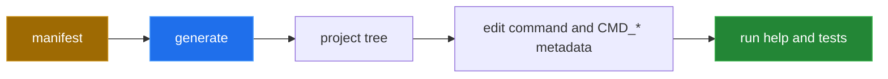

[← back to the overview](../README.md)

# Generator gist



The generator accepts a list of leaf names and command-group objects:

```sh
cat >manifest.json <<'JSON'
[
  "status",
  {"name": "report", "commands": ["daily", "weekly"]}
]
JSON
/bin/sh bin/toolbox generate --name depot --manifest manifest.json --dest ./depot
```

The source contract is:

| Manifest value | Generated path |
|---|---|
| `"status"` | `tools/status` |
| group object | `tools/<group>/__main` |
| child of a group | `tools/<group>/<child>` |

After generation, edit the command file and replace its `CMD_*` placeholders.
Use `--help` to inspect the metadata that the command exposes, then add a TAP
test under `tests/`.

The sequence runs end to end in the Linux container described in
[`measurement.md`](measurement.md). The generated project's own `tests/run`
passes: the generator writes `tests/commands.t` from the manifest
([#5](https://github.com/Bissbert/toolbox.sh/issues/5)). Add your tests alongside it.
