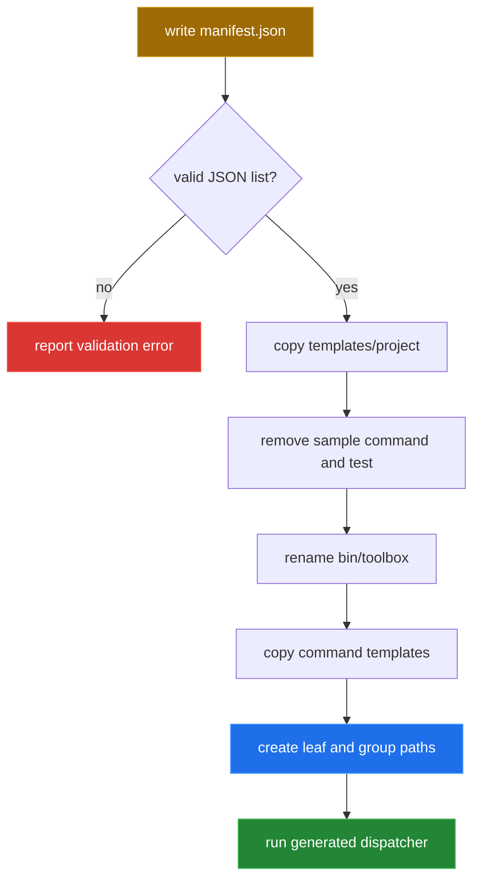
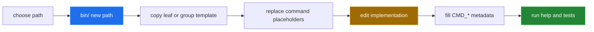

[← back to the overview](../README.md)

# Project generator guide

`tools/generate` turns a JSON manifest into a command-tree skeleton. A string
is a leaf command. An object has a `name` and a `commands` array, and becomes a
group directory with an executable `__main` file. Nested objects are walked
recursively.



## Manifest shape

```json
[
  "status",
  {
    "name": "report",
    "commands": ["daily", {"name": "archive", "commands": ["list"]}]
  }
]
```

The resulting paths are conceptually:

```text
tools/status
tools/report/__main
tools/report/daily
tools/report/archive/__main
tools/report/archive/list
```

The generator also copies the project README, Makefile, libraries, test
harness, command templates and built-in project tools. The generated
dispatcher is renamed to the manifest's `--name` value.

## Adding a command after generation

The intended lifecycle for a new command is:



For a leaf, the last path segment is the file name. For a group, `--group`
creates the directory and its `__main` file. The templates expect the command
to source the libraries relative to the project root and to keep metadata
close to the implementation.

## Running it

```sh
cat >manifest.json <<'JSON'
["status", {"name": "report", "commands": ["daily"]}]
JSON
/bin/sh bin/toolbox generate --name depot --manifest manifest.json --dest ./depot
```

In the Linux container described in [`measurement.md`](measurement.md) this
exits `0` and creates `status`, `report/__main` and `report/daily`.
`./bin/depot help` lists them under the project's own name and version, and
`./bin/depot report daily` runs.

The generated project's `tests/` holds `harness.sh`, `run` and a
`commands.t` written from the manifest. The harness targets `bin/<name>`, and
`commands.t` checks `help`, that `__all_commands` lists every manifest path, and
that each leaf's `--help` and stub exit `0`. For this manifest `sh tests/run`
passes 10 of 10 ([#5](https://github.com/Bissbert/toolbox.sh/issues/5)
records the earlier failure).
