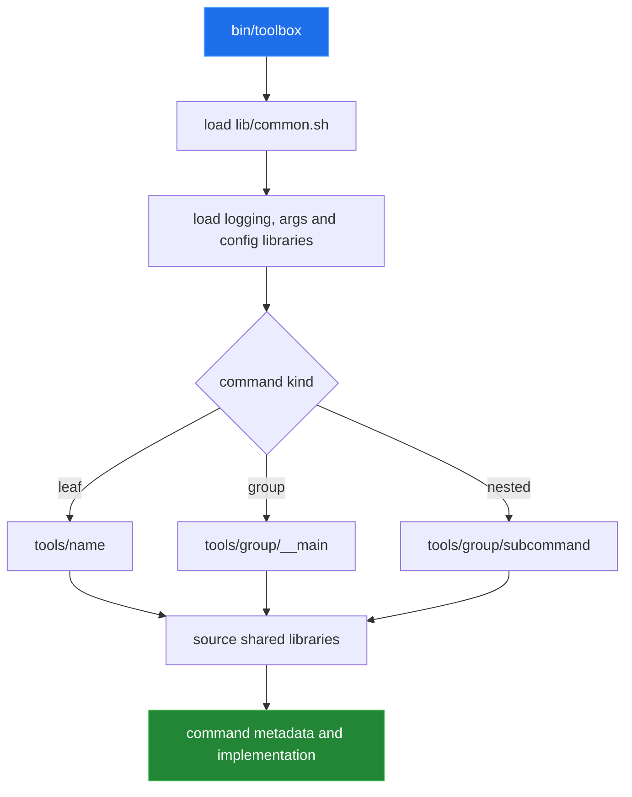
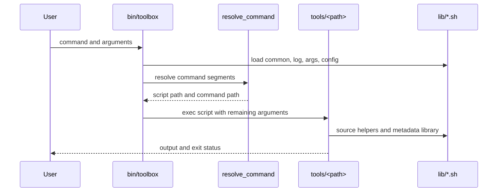
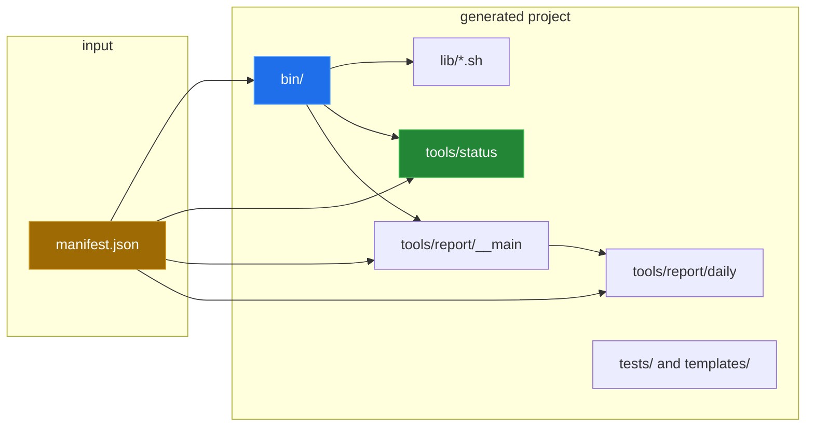

[← back to the overview](../README.md)

# Dispatcher and scaffold architecture

Toolbox.sh uses the filesystem as its command registry. The dispatcher starts
at `tools/`, walks a command path, and executes an executable leaf. A
directory is a command group; an executable `__main` file is the group's own
entry point. The same shape is copied into a generated project.

## What the dispatcher reads

`bin/toolbox` resolves its own root from the directory containing the
dispatcher, then exports `LIB_DIR`, `TOOLS_DIR` and `TEMPLATE_DIR`. It sources
the shared libraries before handling global options. The command resolver in
`lib/common.sh` accepts a sequence of path segments and returns the script
path, the number of consumed segments and the normalized command path.

The intended data flow is:

Discovery accepts only executable files, and lists them with shell globs and a
locale-stable sort, skipping hidden entries and `__main`. Earlier versions
tracked no executable files and used GNU `find -printf`; both are fixed (entries
1 and 4 in [`BUGS-FOUND.md`](BUGS-FOUND.md)).

## Generated project shape

The generator copies `templates/project/`, removes its sample command and
sample test, renames `bin/toolbox` to the requested project name, and copies
the command templates. A manifest then becomes directories and executable
files below `tools/`.

The diagram shows the intended result. On the current revision, generation
stops while creating the first command because the copied project does not
contain `lib/config.sh`; see the measured scratch transcript in
[`measurement.md`](measurement.md).

## Related files

| File | Role |
|---|---|
| `bin/toolbox` | Global options, dispatch and built-in internal queries. |
| `lib/common.sh` | Filesystem command resolution and process helpers. |
| `lib/args.sh` | Required-argument checks and argument utilities. |
| `lib/config.sh` | XDG-derived config, data and cache locations. |
| `lib/log.sh` | Log levels, colors and message functions. |
| `lib/cmd.sh` | Help and completion metadata rendering in the skeleton. |
| `templates/project/` | Source tree copied by `tools/generate`. |
