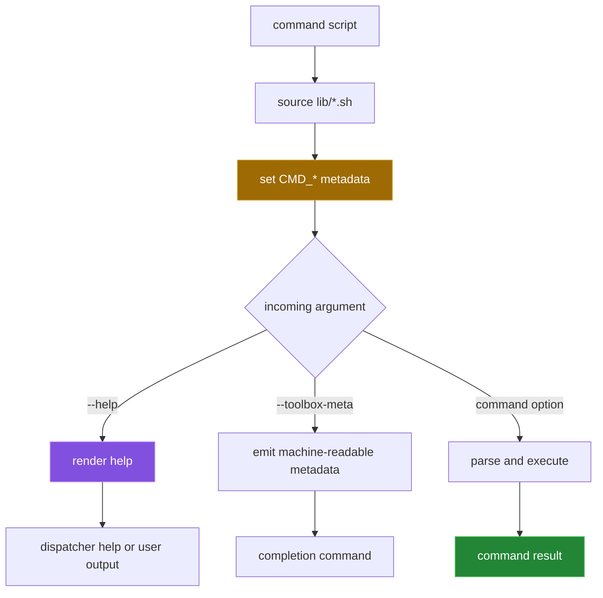
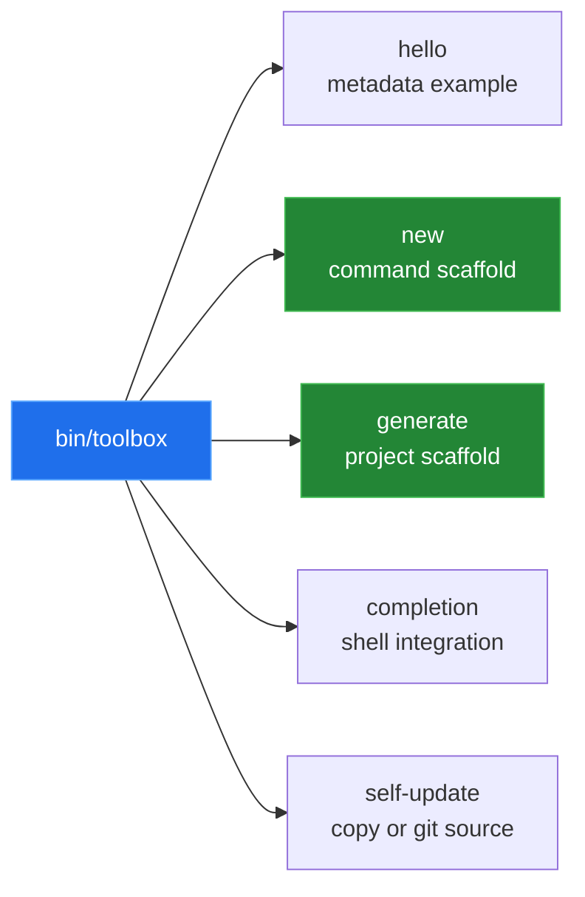

[← back to the overview](../README.md)

# Command contract and conventions

Every command is an executable shell file. It sources the shared libraries,
declares metadata, parses flags and then performs its work. The metadata is
not a separate registry: `lib/cmd.sh` reads variables from the command script
when the dispatcher asks for help or completion data.



## Metadata fields

| Variable | Used for | Convention in the templates |
|---|---|---|
| `CMD_NAME` | Canonical command name. | Set to the command path or leaf name. |
| `CMD_USAGE` | Usage line in help. | Include the project name and accepted arguments. |
| `CMD_SUMMARY` | Short description. | Keep it to one direct sentence. |
| `CMD_DESCRIPTION` | Longer explanation. | Describe observed behavior and side effects. |
| `CMD_OPTIONS` | Help and completion flags. | One `flags\|value\|description` record per line. |
| `CMD_SUBCOMMANDS` | Group help and completion. | One child name per line in a `__main` script. |
| `CMD_EXAMPLES` | Help examples. | One shell invocation per line. |

`cmd_maybe_handle_flag` handles `-h`, `--help` and the internal metadata
request. A command should call it while consuming its argument stream, then
handle its own options. The generated leaf template ends with a stub message;
adding real behavior requires replacing that message and keeping the metadata
accurate.

## Built-in command roles



`hello` is the smallest complete example. `new` copies either
`templates/command/leaf` or `templates/command/group`; `generate` copies the
project skeleton and then delegates path creation to `new`. `completion`
queries `__all_commands` and `__command_meta`, so it depends on both command
discovery and the metadata protocol.

## Adding a leaf command

The intended workflow is:

```sh
/bin/sh bin/toolbox new report weekly
# edit tools/report/weekly
/bin/sh bin/toolbox help report weekly
/bin/sh tests/run
```

The current dispatcher consumes `report` and `weekly` while probing the command
path, then passes no positional arguments to `tools/new`. In a permissions-
prepared scratch copy the same command therefore fails as an unknown command
path instead of creating the leaf. This is a measured limitation, not a
working quick-start claim; the exact proposed change is in
[`BUGS-FOUND.md`](BUGS-FOUND.md).

## What the scaffold enforces

- A command must be executable before the dispatcher will list or resolve it.
- A group is represented by a directory and its `__main` entry point.
- Help and completion are derived from `CMD_*` fields instead of a second
  command registry.
- `tools/new` fills placeholders in the command templates and makes a copied
  leaf executable at runtime.
- The test harness expects shell scripts and emits TAP-like `ok` and `not ok`
  records.

These conventions make the tree inspectable, but they also explain why file
mode and shell-compatibility defects have a wide blast radius. See
[`measurement.md`](measurement.md) for the commands used to observe them.
