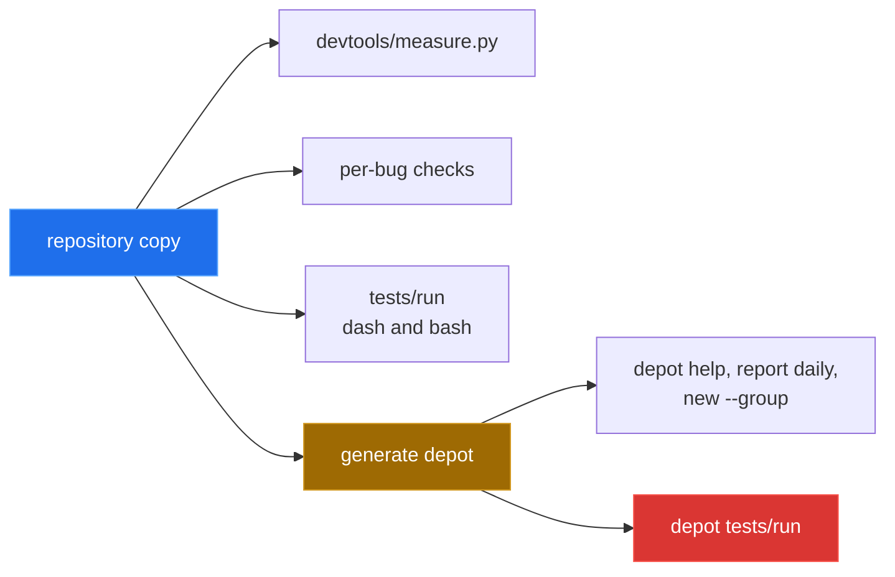

[← back to the overview](../README.md)

# How this was measured

Every result in the overview comes from one script run in a Linux container:

```sh
sh devtools/linux-run.sh > media/captures/linux-run.txt
```

[`devtools/linux-run.sh`](../devtools/linux-run.sh) starts
`python:3.12-slim-bookworm`, installs `git`, mounts the repository read-only
and copies it with its history. It then runs
[`devtools/measure.py`](../devtools/measure.py), a check for each entry in
[Bugs found](BUGS-FOUND.md), the test suite under `dash` and `bash`, and the
test suite of a freshly generated project. The full output is
[`media/captures/linux-run.txt`](../media/captures/linux-run.txt); every block
below is taken from it.

## Environment

| | |
|---|---|
| Kernel | Linux 6.5.11-linuxkit, aarch64 (Docker Desktop VM) |
| Image | `python:3.12-slim-bookworm` (`sha256:392307d2…23564e`) |
| Shells | `/bin/sh` is `dash`; GNU bash 5.2.15 |
| Tools | git 2.39.5, Python 3.12.14 |
| Commit | `a8861f0` |
| Date | 2026-09-24 |



## `devtools/measure.py`

```text
source_base    a8861f0
tracked_files    55
tracked_executable_files    21
version_rc    0
version_output    toolbox 0.1.0
help_rc    0
help_commands    5
direct_version_rc    0
direct_version_output    toolbox 0.1.0
tests_rc    0
tests_ok    20
tests_not_ok    0
config_ignore_rc    1
config_ignore_output
scratch_help_rc    0
scratch_help_commands    5
scratch_hello_rc    0
scratch_hello_output    toolbox: Hello, Alice!
scratch_generate_rc    0
scratch_generate_output    toolbox: Copying skeleton into <scratch>/depot\ndepot: created status\ntoolbox: Project 'depot' generated at <scratch>/depot
```

`config_ignore_rc` is `1` because `git check-ignore` no longer matches
`templates/project/lib/config.sh`. The scratch probe runs from a `git archive`
of `HEAD`, so it does not depend on the modes in the working copy.

## The top-level toolbox

| Check | Result |
|---|---|
| Tracked modes | 34 × `100644`, 21 × `100755` |
| `./bin/toolbox --version` | `toolbox 0.1.0`, exit `0` |
| `./bin/toolbox help` | lists `completion`, `generate`, `hello`, `new`, `self-update` |
| `USER=nobody ./bin/toolbox hello Alice` | `toolbox: Hello, Alice!` |
| `sh bin/toolbox __all_commands` under `dash` | the same five commands, exit `0` |
| `sh tests/run` (`dash`) | exit `0`, 20 ok, 0 not ok |
| `bash tests/run` | exit `0`, 20 ok, 0 not ok |

## A generated project

The README's manifest, `["status", {"name": "report", "commands": ["daily"]}]`,
generates `depot`:

```text
toolbox: Copying skeleton into <scratch>/depot
depot: created status
depot: created report/daily
depot: created report/__main
toolbox: Project 'depot' generated at <scratch>/depot
exit=0
```

`depot/lib/` holds `args.sh`, `cmd.sh`, `common.sh`, `config.sh` and `log.sh`.

| Check | Result |
|---|---|
| `./bin/depot help` | starts `depot 0.1.0`; lists `completion`, `new`, `report`, `self-update`, `status` |
| `./bin/depot report daily --help` | usage, options, and `Examples:` / `depot report daily` |
| `./bin/depot report daily` | `depot: report daily is not implemented yet`, exit `0` |
| `./bin/depot new --group demo` | `depot: created demo/__main`; `help` then lists `demo` |
| `sh tests/run` | exit `1`, 0 ok, 14 not ok ([entry 11](BUGS-FOUND.md)) |

The generated project's tests still call `bin/toolbox` and expect the `hello`
and `generate` commands, which the generator removes or does not copy:

```text
not ok 1 - help shows commands header
  ---
    pattern: Commands:
    got:     sh: 0: cannot open <scratch>/depot/bin/toolbox: No such file
```

## Not covered

- macOS. Entries 4 and 7 were macOS-only failures. The Linux run shows that
  the new code works under `dash` and `bash`, but it does not re-run the macOS
  shell or BSD `find`.
- `make install`, the Debian package in `packaging/deb/`, `self-update` and
  shell completion installed into a real shell.
- No terminal session was recorded. The diagrams in the other write-ups
  explain the source; they are not recordings.
