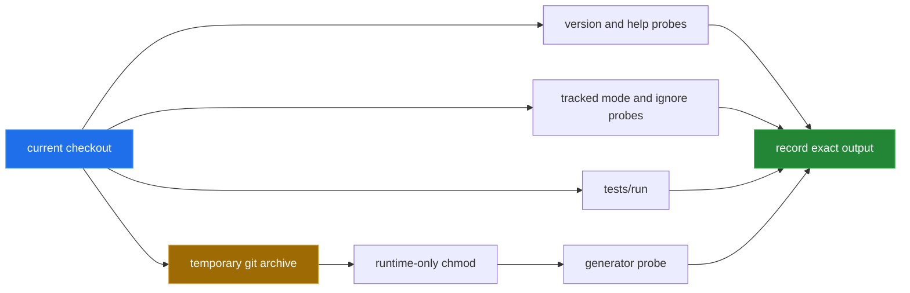

[← back to the overview](../README.md)

# Measurement and provenance

This pass reports the reverted checkout at `e4cd682`, not a repaired copy. A
re-run on the fixed default branch is recorded below it for comparison. The only
measurement runner committed for the pass is
[`devtools/measure.py`](../devtools/measure.py). It uses Python's standard
library, runs the shell commands directly, and uses a temporary `git archive`
when a source-path probe needs executable permissions. Permissions are changed
only in that temporary archive.



## Reproduction command

Run this from the repository root:

```sh
python3 devtools/measure.py
```

The command actually run for this pass printed:

```text
source_base    e4cd682
tracked_files    48
tracked_executable_files    0
version_rc    0
version_output    toolbox 0.1.0
help_rc    0
help_commands    0
direct_version_rc    126
direct_version_output    PermissionError: [Errno 13] Permission denied: './bin/toolbox'
tests_rc    127
tests_ok    1
tests_not_ok    5
config_ignore_rc    0
config_ignore_output    templates/project/.gitignore:9:config.sh	templates/project/lib/config.sh
scratch_help_rc    0
scratch_help_commands    0
scratch_hello_rc    0
scratch_hello_output    toolbox: Hello, docs-pass!
scratch_generate_rc    1
scratch_generate_output    toolbox: Copying skeleton into <scratch>/depot\n<scratch>/depot/tools/new: line 17: <scratch>/depot/lib/config.sh: No such file or directory
```

The values in the README table are copied from this output. The scratch
`hello` probe sets `USER=docs-pass` so its output does not depend on the
machine's login name. The scratch generator uses the current `HEAD` archive,
adds executable bits only in that temporary tree, and still stops at the
missing generated config library.

## Additional bug probes

The following commands were run separately to isolate defects that the main
probe reports but does not fully explain.

On a temporary copy with runtime executable bits, the macOS shell produced an
empty command listing because `find` does not support `-printf`:

```text
Commands:

  Help:
status=0
```

On the same host, `tools/new --group demo` failed during parsing:

```text
/tmp/toolbox-new.XXXXXX/tools/new: line 119: syntax error near unexpected token `;;'
status=2
```

In the Debian `python:3.12-slim-bookworm` container, `dash` reached the
non-POSIX substitution in `__all_commands`:

```text
bin/toolbox: 112: Bad substitution
status=0
```

The exact temporary-directory suffixes are intentionally not part of the
published result; the command, shell, status and error are what matter.

## Re-run after the fixes

The same command on the fixed default branch at `f3a0d9f` printed:

```text
source_base    f3a0d9f
tracked_files    55
tracked_executable_files    21
version_rc    0
version_output    toolbox 0.1.0
help_rc    0
help_commands    5
direct_version_rc    0
direct_version_output    toolbox 0.1.0
tests_rc    0
tests_ok    20
tests_not_ok    0
config_ignore_rc    1
config_ignore_output
scratch_help_rc    0
scratch_help_commands    5
scratch_hello_rc    0
scratch_hello_output    toolbox: Hello, Alice!
scratch_generate_rc    0
scratch_generate_output    toolbox: Copying skeleton into <scratch>/depot\ndepot: created status\ntoolbox: Project 'depot' generated at <scratch>/depot
```

`config_ignore_rc` is `1` because the `grep` that looked for the ignore rule
now finds nothing, which is the fixed state.

## What was not measured

At the time of this pass the generator could not reach a complete generated
toolset, because `templates/project/lib/config.sh` was absent. The pass
therefore published no command counts, test results or runtime for a successful
generated project; the re-run above supplies them. No animation is claimed:
no complete real session was captured. The diagrams in the other write-ups are
source-level explanations, not recordings.

The applied fixes and the distinction between verified and inferred behavior
are in [`BUGS-FOUND.md`](BUGS-FOUND.md).
